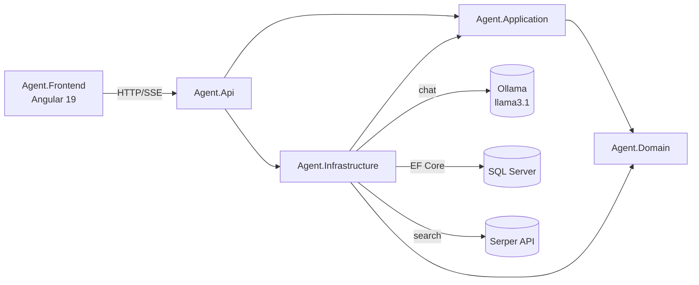
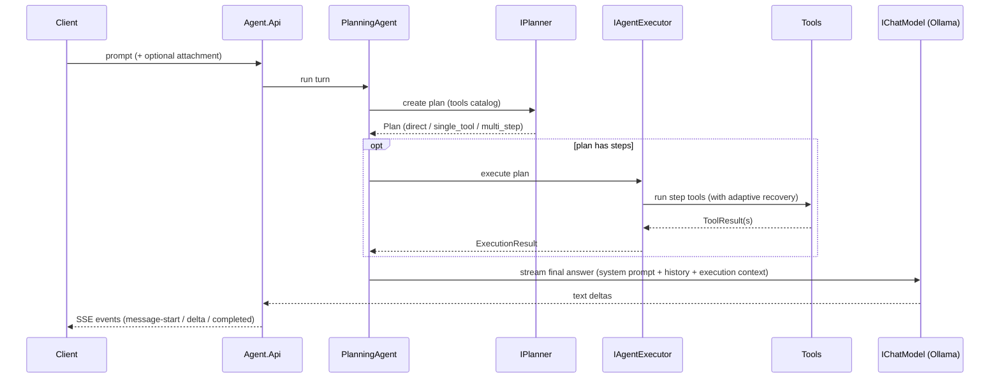

# LMMs.Api

An LLM-powered chat platform built as a **planning AI agent** over a clean-architecture .NET 9 backend, with a standalone Angular frontend. Users register and sign in with JWT-based accounts, hold multi-turn conversations that are persisted to SQL Server, attach documents, and receive streamed answers produced by a local [Ollama](https://ollama.com/) model that can plan and call tools (calculator, date/time, web search, file reading).

## Features

- **Planning agent** — every user prompt is turned into a JSON plan (`direct`, `single_tool`, or `multi_step`) by the model itself; tools run through an executor with adaptive recovery when a step fails.
- **Streaming responses** — answers are streamed token-by-token over Server-Sent Events (`text/event-stream`).
- **Accounts & conversations** — ASP.NET Core JWT authentication; conversations, messages, and tool executions are owned per user and stored in SQL Server via EF Core.
- **Attachments** — upload `txt`, `csv`, `json`, `xml`, `md`, `pdf`, or `docx` files (up to 10 MB); the agent can read them through a `read_file` tool.
- **Tool catalog** — `Calculator`, `GetDate`, `GetTime`, `web_search` (Serper), `read_file`.
- **Angular chat UI** — markdown-rendered messages, conversation history, attachment upload; dev server proxies `/api` to the backend.

## Solution layout

| Project | Layer | Responsibility |
| --- | --- | --- |
| `Agent.Api` | Presentation | ASP.NET Core composition root: controllers, HTTP contracts, auth middleware, CORS, Swagger, health checks |
| `Agent.Application` | Use cases | Agent orchestration, planning, execution, tool registry, conversation turn service, auth service, and all ports (interfaces) |
| `Agent.Domain` | Domain | Framework-free entities and concepts: conversations, plans, steps, execution directives, tool results, persistence entities |
| `Agent.Infrastructure` | Adapters | Ollama chat model, Serper web search, JWT/password services, EF Core SQL Server persistence, attachment storage, concrete tools |
| `Agent.Frontend` | Presentation | Standalone Angular 19 application (own build lifecycle; not served by the backend) |
| `Agent.Tests` | Tests | xUnit tests for domain, planning, execution, tools, and orchestration |



## Agent request flow



Planning never executes tools; the executor never creates the initial plan; the agent coordinates both and builds only the final answer context.

## Quick start

**Prerequisites:** .NET 9 SDK · SQL Server (local or container) · [Ollama](https://ollama.com/) with `llama3.1` pulled · Node.js 20+ (frontend only)

```bash
# 1. Configure secrets (connection string + JWT + optional Serper key)
dotnet user-secrets set "ConnectionStrings:LMMsDatabase" "Server=localhost,1433;Database=LMMs;User Id=sa;Password=<strong-password>;TrustServerCertificate=True;Encrypt=True" --project Agent.Api
dotnet user-secrets set "Authentication:Jwt:Issuer" "LMMs.Api" --project Agent.Api
dotnet user-secrets set "Authentication:Jwt:Audience" "LMMs.Web" --project Agent.Api
dotnet user-secrets set "Authentication:Jwt:SigningKey" "<random-secret-at-least-32-chars>" --project Agent.Api

# 2. Create the database schema
dotnet ef database update --project Agent.Infrastructure --startup-project Agent.Api

# 3. Run the API  (https://localhost:7098, swagger at /swagger in Development)
dotnet run --project Agent.Api --launch-profile https

# 4. Run the frontend (http://localhost:4200, proxies /api to the API)
cd Agent.Frontend
npm ci
npm start
```

A detailed walkthrough lives in [docs/local-persistence-setup.md](docs/local-persistence-setup.md); every setting is documented in [docs/configuration.md](docs/configuration.md).

## Testing

```bash
dotnet test
```

`Agent.Tests` covers domain invariants, plan parsing, tool selection, sequential execution, attachment storage, the calculator, and end-to-end agent orchestration with fake chat models. See [docs/components/agent-tests.md](docs/components/agent-tests.md).

## Documentation

| Document | Contents |
| --- | --- |
| [ARCHITECTURE.md](ARCHITECTURE.md) | Dependency rules, request flow, extension points |
| [docs/README.md](docs/README.md) | Full documentation index |
| [docs/api-reference.md](docs/api-reference.md) | HTTP endpoints, DTOs, and SSE event reference |
| [docs/configuration.md](docs/configuration.md) | Every configuration key, secrets, and environment variables |
| [docs/components/agent-api.md](docs/components/agent-api.md) | `Agent.Api` — controllers, contracts, middleware pipeline |
| [docs/components/agent-application.md](docs/components/agent-application.md) | `Agent.Application` — agent, planner, executor, services, ports |
| [docs/components/agent-domain.md](docs/components/agent-domain.md) | `Agent.Domain` — entities and planning/tool model |
| [docs/components/agent-infrastructure.md](docs/components/agent-infrastructure.md) | `Agent.Infrastructure` — Ollama, SQL Server, JWT, Serper, files, tools |
| [docs/components/agent-frontend.md](docs/components/agent-frontend.md) | `Agent.Frontend` — Angular app structure and flows |
| [docs/components/agent-tests.md](docs/components/agent-tests.md) | `Agent.Tests` — test suite layout and doubles |
| [docs/local-persistence-setup.md](docs/local-persistence-setup.md) | Local SQL Server + secrets setup walkthrough |
| [docs/sql-server-user-management-design.md](docs/sql-server-user-management-design.md) | Design record for SQL-backed users and conversations |
