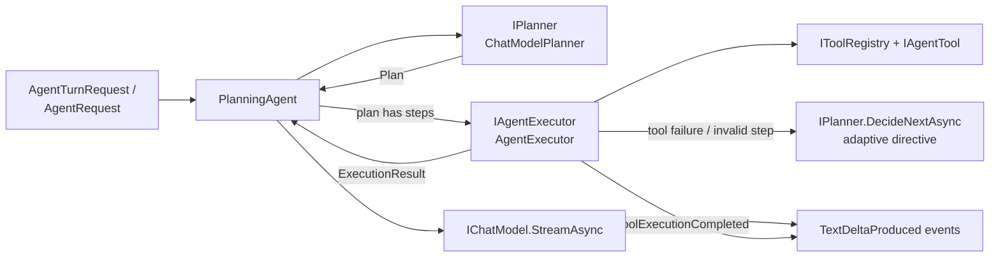

# Agent.Application — use cases and agent pipeline

The application layer owns every use case: agent orchestration, planning, plan execution, tool selection, conversation persistence workflows, and authentication. It defines **ports** (interfaces) for everything external — chat model, storage, search, time, current user, repositories — and references nothing concrete: no ASP.NET Core, no Ollama, no EF Core, no HTTP.

- **Project:** `Agent.Application/Agent.Application.csproj` (`net9.0`)
- **References:** `Agent.Domain`, `Microsoft.Extensions.DependencyInjection.Abstractions` only

## The agent pipeline

The heart of the system. One turn flows through three strictly separated stages:

- **The planner never executes tools.** It only produces a `Plan` or an `ExecutionDirective`.
- **The executor never plans from scratch.** It runs steps and consults the planner only to recover from failures.
- **The agent never calls tools.** It coordinates planner and executor, builds the final prompt, and streams the answer.

## `Agents/`

| Type | Role |
| --- | --- |
| `IAgent` / `AgentRequest` | Simple interface used by the legacy `/api/chat` endpoint: `RunAsync(request, conversation, ct)` streams text chunks against an in-memory `Conversation`. |
| `IAgentTurnRunner` / `AgentTurnRequest` | Rich interface used by the persisted conversation flow: takes the prompt plus `AgentHistoryMessage` history and optional attachment, returns structured `AgentTurnEvent`s. |
| `AgentTurnEvent` hierarchy | `ToolExecutionCompleted(ToolResult)`, `TextDeltaProduced(string)`, `AgentTurnCompleted(modelName)`. |
| `PlanningAgent` | Implements **both** `IAgent` and `IAgentTurnRunner`; the single coordination point. Registered once and exposed through both interfaces. |

`PlanningAgent` internals:

- **Tool selection** — `IToolRegistry.Select(hasAttachment)`; the whole applicable catalog is offered to the planner, which decides whether tools are needed.
- **Planning context** — last 6 conversation messages, each truncated to 200 characters.
- **Answer context** — system prompt + as many recent messages as fit in an estimated 5,000-token budget (`chars/4 + 4` per message) + a formatted execution summary (goal, status, per-step tool/result/error truncated to 1,500 chars) whenever tools ran.
- **System prompts** — three variants depending on whether execution results exist, tools were merely available, or no tools exist at all; all forbid inventing tool results or leaking plans/JSON.
- **Attachments** — when `AttachmentName` is present the prompt is annotated so the model knows it may call `read_file`; the attachment id flows to the executor via `ToolContext.AttachmentId`.
- **History mapping (`RunTurnAsync`)** — replays persisted history into an ephemeral in-memory `Conversation`; if the current prompt isn't the last history item it is appended.
- **In-memory trimming (`RunAsync`)** — appends user/assistant messages and trims the legacy conversation to the last 20 messages.

## `Planning/`

| Type | Role |
| --- | --- |
| `IPlanner` | `CreatePlanAsync(PlanningRequest)` → `Plan`; `DecideNextAsync(ExecutionState)` → `ExecutionDirective` (used for adaptive recovery). |
| `PlanningRequest` / `ExecutionState` | Inputs: prompt + recent conversation + tool definitions; and user goal + plan + results so far + failure reason. |
| `ChatModelPlanner` | `IPlanner` backed by `IChatModel` with temperature 0. **Fail-safe:** no tools → direct plan without a model call; any planning error → direct plan; any advisory error → abort directive. Prompts demand strict JSON. |
| `PlanJsonParser` | Tolerant parser: strips markdown fences, extracts the outermost `{…}`, accepts enum synonyms (`direct`/`none`, `single`/`tool`, `multi`), infers the kind from step count, and maps `action: continue/execute_step/complete/abort` to directives with a fallback step id. |

## `Execution/`

| Type | Role |
| --- | --- |
| `IAgentExecutor` | `ExecuteAsync(plan, tools, userGoal, attachmentId, ct)` → `ExecutionResult`. |
| `AgentExecutor` | Sequential step runner with adaptive recovery. Limits: **8 total steps**, **3 adaptive (planner-suggested) steps**. On invalid step input or tool failure it asks `IPlanner.DecideNextAsync` whether to continue, retry with a new step, complete, or abort. Unknown tools and thrown tool exceptions become failed `ToolResult`s rather than crashing the turn. Direct plans short-circuit to `Completed`. |
| `PlanStepResolver` | Placeholder substitution between steps — `{{1}}`, `{{step:1}}`, `{{step1.result}}`, bare `step1` — plus calculator-specific normalization: combines scattered numeric inputs into one expression, coerces dates to their day-of-month, and validates math expressions. |

## `Tools/`

| Type | Role |
| --- | --- |
| `ToolDefinition` | Name, description, parameter names, `ToolCategory` (`General`, `WebSearch`, `File`). |
| `ToolContext` | Arguments dictionary + optional `AttachmentId`. |
| `IAgentTool` | `Definition` + `ExecuteAsync` — implement this to add a tool (no changes to agent/executor needed). |
| `IToolRegistry` / `ToolRegistry` | `Select(hasAttachment)` hides `File`-category tools unless an attachment exists; `Find` resolves model-produced names against a normalization alias map (`calc`→`Calculator`, `time`→`GetTime`, `date`→`GetDate`, `search`→`web_search`, `file`→`read_file`, …). |

Concrete tools live in [Agent.Infrastructure](agent-infrastructure.md#tools).

## `Conversations/`

| Type | Role |
| --- | --- |
| `ConversationTurnService` | The persisted chat use case behind `ConversationsController`. |
| Contracts | `CreateConversationCommand`, `SendMessageCommand`, `ConversationSummaryDto`, `MessageDto`, `MessagePageDto`, `ConversationDetailDto`, `ConversationStreamEvent`, `AgentHistoryMessage`/`AgentHistoryRole`. |
| `IConversationStore` | Process-local store for the **legacy** `/api/chat` flow. |

`ConversationTurnService` behavior:

- **Ownership** — every query is filtered by the current user's id (`ICurrentUser`); unauthenticated use throws `UnauthorizedAccessException`, foreign resources surface as `ResourceNotFoundException` (→ 404).
- **Send flow** — persists the user message and an empty `Streaming` assistant placeholder in one unit of work, emits `message-start`, replays bounded history (≤ 20 messages / ≤ 20,000 chars) to `IAgentTurnRunner.RunTurnAsync`, streams `delta` events, persists each completed tool execution against the assistant message, then finalizes the placeholder as `Completed` — or `Cancelled`/`Failed` in a `finally` block, saved with `CancellationToken.None` so cleanup always completes.
- **Auto-titling** — a conversation still named `"New chat"` is renamed from its first prompt (whitespace-collapsed, ≤ 80 chars).
- **Limits** — list page ≤ 100; message page ≤ 100; prompt ≤ 16,000 chars; title ≤ 200; persisted tool text ≤ 16,000 chars (errors ≤ 2,000).

## `Authentication/`

| Type | Role |
| --- | --- |
| `AuthService` | `RegisterAsync` / `LoginAsync`. Normalizes email/username (`Trim().ToUpperInvariant()`) for uniqueness checks, hashes passwords via `IPasswordService`, issues tokens via `ITokenService`, stamps `CreatedAt/UpdatedAt/LastLoginAt` from `IClock`. Throws `ConflictException` (duplicate account), `RequestValidationException` (bad fields), `UnauthorizedAccessException` (bad login). |
| `IPasswordService` | Hash/verify port (implemented with ASP.NET Core Identity's `PasswordHasher`). |
| Contracts | `RegisterUserCommand`, `LoginCommand`, `AccessToken`, `CurrentUserDto`, `AuthResultDto`. |

Password rules (12–128 chars) and username charset (letters, digits, `. _ -`) are enforced here in addition to the API DTO attributes.

## `Persistence/` ports

| Port | Purpose |
| --- | --- |
| `IUserRepository` | Find by normalized email/username; add users. |
| `IConversationRepository` | Add, fetch-owned, list-owned (summaries), delete-owned conversations. |
| `IChatMessageRepository` | Add message ranges; bounded recent history for the agent; cursor-paged owned pages. |
| `IToolExecutionRepository` | Append tool execution audit rows. |
| `IUnitOfWork` | `SaveChangesAsync` — all writes commit through one unit of work. |
| `ICurrentUser` | Authenticated user id/email/username. |
| `ITokenService` | Issue an `AccessToken` for a user. |
| `IConversationTurnService` | The conversation use-case surface used by the API. |
| `IClock` / `SystemClock` | UTC time abstraction (singleton). |

## Other ports

| Port | Purpose |
| --- | --- |
| `Chat/IChatModel` | Streaming + non-streaming completion over domain `Message`s; `ChatModelOptions(Temperature = 0.1f)`. Swap this to change AI providers. |
| `Files/IAttachmentStore` | Save/read attachment content (`StoredAttachment`). Swap to move off local disk. |
| `Search/IWebSearchProvider` | One-method web search port used by `WebSearchTool`. |

## `Common/`

`ResourceNotFoundException` (→ 404), `RequestValidationException` (→ 400), `ConflictException` (→ 409) — shared application exceptions mapped to HTTP by the API layer.

## Dependency injection

`AddAgentApplication` (all scoped except the clock):

| Service | Implementation |
| --- | --- |
| `IPlanner` | `ChatModelPlanner` |
| `IAgentExecutor` | `AgentExecutor` |
| `IToolRegistry` | `ToolRegistry` |
| `PlanningAgent` | concrete, also exposed as `IAgent` and `IAgentTurnRunner` |
| `IAuthService` | `AuthService` |
| `IConversationTurnService` | `ConversationTurnService` |
| `IClock` | `SystemClock` (singleton) |
